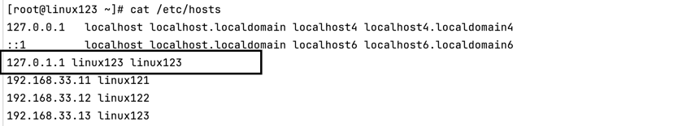

# 虚拟机环境准备
创建vagrant, 
```shell
# Vagrantfile

Vagrant.configure("2") do |config|
  # 定义虚拟机数量和基本配置
  (1..3).each do |i|
    config.vm.define "data_#{i}" do |web|
      web.vm.box = "centos/stream9"  # 使用 centos

      # 设置网络
      web.vm.network "private_network", ip: "192.168.33.#{i + 10}"
      web.vm.hostname = "linux12#{i}"

      # 可选：设置虚拟机内存和 CPU
      web.vm.provider "virtualbox" do |vb|
        vb.memory = "1024"  # 设置内存
        vb.cpus = 1         # 设置 CPU 数量
      end


      web.vm.provision "shell", inline: <<-SHELL
          # 设置root用户密码
          echo "root:vagrant" | chpasswd
          sed -i 's/#PermitRootLogin prohibit-password/PermitRootLogin yes/' /etc/ssh/sshd_config
          systemctl restart sshd

          # 配置使用host访问其他虚拟机
          echo "192.168.33.11 linux121" >> /etc/hosts
          echo "192.168.33.12 linux122" >> /etc/hosts
          echo "192.168.33.13 linux123" >> /etc/hosts
       SHELL

      # 可选：设置同步文件夹
#     web.vm.synced_folder ".", "/vagrant_data"  # 将当前目录同步到虚拟机的 /vagrant_data

      # Provisioning: 安装 JDK 8 和 Docker
      web.vm.provision "shell", inline: <<-SHELL
          # 更新系统
          yum update -y

          # 安装 Java JDK 8
#           yum install -y java-1.8.0-openjdk-devel

          # 安装 Docker
          yum install -y yum-utils
          yum-config-manager --add-repo https://download.docker.com/linux/centos/docker-ce.repo
          yum install -y docker-ce docker-ce-cli containerd.io

          # 启动 Docker 服务
          systemctl start docker
          systemctl enable docker

          # 验证安装
#           java -version
          docker --version
        SHELL
    end
  end
end
```

# 在每台虚拟机中安装jdk以及Hadoop环境
```shell
mkdir -p /opt/lagou/software --软件安装包存放目录 
mkdir -p /opt/lagou/servers --软件安装目录
```
## 1.上传文件到虚拟机指定目录下
```shell
# scp 本地文件路径 虚拟机用户@虚拟机地址:虚拟机目标路径
scp ./hadoop-2.9.2.tar.gz root@192.168.33.11:/opt/lagou/software/
scp ./jdk-8u231-linux-x64.tar.gz root@192.168.33.11:/opt/lagou/software/
```

## 2.解压zip包到指定路径
```shell
tar -zxvf hadoop-2.9.2.tar.gz -C /opt/lagou/servers
tar -zxvf jdk-8u231-linux-x64.tar.gz -C /opt/lagou/servers
```
## 3. 添加环境变量
```shell
vi /etc/profile

##JAVA_HOME
export JAVA_HOME=/opt/lagou/servers/jdk1.8.0_231
export PATH=$PATH:$JAVA_HOME/bin
export PATH=$PATH:$JAVA_HOME/sbin
##HADOOP_HOME
export HADOOP_HOME=/opt/lagou/servers/hadoop-2.9.2
export PATH=$PATH:$HADOOP_HOME/bin
export PATH=$PATH:$HADOOP_HOME/sbin

# 使环境变量生效
source /etc/profile
```

## 4.验证
```shell
java -version
hadoop version
```

# hadoop 集群搭建
Hadoop集群配置 = HDFS集群配置 + MapReduce集群配置 + Yarn集群配置
HDFS集群配置
1. 将JDK路径明确配置给HDFS(修改hadoop-env.sh)
2. 指定NameNode节点以及数据存储目录(修改core-site.xml)
3. 指定SecondaryNameNode节点(修改hdfs-site.xml)
4. 指定DataNode从节点(修改etc/hadoop/slaves文件，每个节点配置信息占一行)
MapReduce集群配置
1. 将JDK路径明确配置给MapReduce(修改mapred-env.sh)
2. 指定MapReduce计算框架运行Yarn资源调度框架(修改mapred-site.xml)
Yarn集群配置
1. 将JDK路径明确配置给Yarn(修改yarn-env.sh)
2. 指定ResourceManager老大节点所在计算机节点(修改yarn-site.xml) 
3. 指定NodeManager节点(会通过slaves文件内容确定)

## HDFS集群配置
```shell
cd /opt/lagou/servers/hadoop-2.9.2/etc/hadoop
```
### 将JDK路径明确配置给HDFS

```shell
vi hadoop-env.sh
export JAVA_HOME=/opt/lagou/servers/jdk1.8.0_231
```

### 指定NameNode节点以及数据存储目录
```shell
vi core-site.xml

<!-- 指定HDFS中NameNode的地址 -->
<property>
    <name>fs.defaultFS</name>
    <value>hdfs://linux121:9000</value>
</property>
<!-- 指定Hadoop运行时产生文件的存储目录 --> <property>
    <name>hadoop.tmp.dir</name>
    <value>/opt/lagou/servers/hadoop-2.9.2/data/tmp</value>
</property>
```

### 指定secondarynamenode节点
```shell
vi hdfs-site.xml
<!-- 指定Hadoop辅助名称节点主机配置 --> 
<property>
      <name>dfs.namenode.secondary.http-address</name>
      <value>linux123:50090</value>
</property>
<!--副本数量 --> 
<property>
        <name>dfs.replication</name>
        <value>3</value>
</property>
```

### 指定datanode从节点
```shell
# 修改slaves文件，每个节点配置信息占一行
vi slaves

linux121
linux122
linux123
```

## MapReduce集群配置

### 指定MapReduce使用的jdk路径
```shell
vi mapred-env.sh
export JAVA_HOME=/opt/lagou/servers/jdk1.8.0_231
```

### 指定MapReduce计算框架运行Yarn资源调度框架
```shell
mv mapred-site.xml.template mapred-site.xml
vi mapred-site.xml
<!-- 指定MR运行在Yarn上 --> 
<property>
        <name>mapreduce.framework.name</name>
        <value>yarn</value>
</property>
```

## Yarn集群配置
### 指定JDK路径
```shell
vi yarn-env.sh
export JAVA_HOME=/opt/lagou/servers/jdk1.8.0_231
```

### 指定ResourceMnager的master节点信息
```shell
vi yarn-site.xml
<!-- 指定YARN的ResourceManager的地址 --> 
<property>
        <name>yarn.resourcemanager.hostname</name>
        <value>linux123</value>
</property>
<!-- Reducer获取数据的方式 -->
 <property>
        <name>yarn.nodemanager.aux-services</name>
        <value>mapreduce_shuffle</value>
</property>
```

### 指定NodeManager节点 
(slaves文件已修改)
注意:
Hadoop安装目录所属用户和所属用户组信息，默认是501 dialout，而我们操作Hadoop集群的用户使 用的是虚拟机的root用户，
所以为了避免出现信息混乱，修改Hadoop安装目录所属用户和用户组!!
```shell
chown -R root:root /opt/lagou/servers/hadoop-2.9.2
```

## rsync 复制到其他节点
### 三台虚拟机安装rsync 
```shell
yum install -y rsync
```
### 把linux121机器上的/opt/lagou/software目录同步到linux122服务器的root用户下的/opt/目录
```shell
rsync -rvl /opt/lagou/software/ root@linux122:/opt/lagou/software
```

### 集群分发脚本编写
需求:循环复制文件到集群所有节点的相同目录下
```shell
#!/bin/bash
#脚本编写大致步骤
# 需求:循环复制文件到集群所有节点的相同目录下
# 使用方式：脚本+需要复制的文件名称
#1.获取传入脚本的参数，参数个数
paramnum=$#
if((paramnum==0));
then
  echo no args;
exit;
fi

#2.获取到文件名称
p1=$1

file_name=`basename $p1`
echo fname=${file_name}

#3.获取到文件的绝对路径，获取文件的目录信息
dir_name=`cd -P $(dirname $p1);pwd`
#dir_name=`dirname $p1`
echo dirname=${dir_name}

#4.获取当前用户信息
user=`whoami`
#5 执行rsync命令，循环执行,要把数据发送到其他节点
for((host=121;host<124;host++));
do
  echo --------------target hostname=linux$host----------
  rsync -rvl ${dir_name}/${file_name} ${user}@linux${host}:${dir_name}
done
```

执行
```shell
cd /usr/local/bin
./rsync-script /opt/lagou/servers
```

# 设置主节点访问从节点不需要密码
## 配置SSH无密码登录（所有节点）
在每个节点上执行：
```shell
# 生成SSH密钥（如果尚未生成）
ssh-keygen -t rsa -P '' -f ~/.ssh/id_rsa

# 将公钥添加到authorized_keys
cat ~/.ssh/id_rsa.pub >> ~/.ssh/authorized_keys

# 设置正确的权限
chmod 700 ~/.ssh
chmod 600 ~/.ssh/authorized_keys
```
## 将主节点的公钥分发到所有从节点

在主节点上执行
```shell
for linux in linux121 linux122 linux123; do
  ssh-copy-id -i ~/.ssh/id_rsa.pub $linux
done
```
## 验证SSH无密码登录
```shell
# 从主节点测试连接到每个从节点
ssh linux122
# 应该不需要密码就能登录
exit

ssh linux123
exit
```

# 启动集群
**注意:如果集群是第一次启动，需要在Namenode所在节点格式化NameNode，非第一次不用执行格 式化Namenode操作!!**
## 单节点启动
### 格式化Namenode 
```shell
hadoop namenode -format
```
格式化后创建的文件:/opt/lagou/servers/hadoop-2.9.2/data/tmp/dfs/name/current

### 在linux121上启动NameNode
```shell
hadoop-daemon.sh stop namenode
hadoop-daemon.sh start namenode
```

### 在linux121、linux122以及linux123上分别启动DataNode
```shell
hadoop-daemon.sh stop datanode
hadoop-daemon.sh start datanode
```

### web端查看Hdfs界面
```shell
http://linux121:50070/dfshealth.html#tab-overview
```

### Yarn集群单节点启动
在Linux123节点启动 resourcemanager
```shell
yarn-daemon.sh stop resourcemanager
yarn-daemon.sh start resourcemanager
```
在其他节点启动nodemanager
```shell
yarn-daemon.sh stop nodemanager
yarn-daemon.sh start nodemanager
```

### 集群群起
在Linux121节点启动dfs
```shell
sbin/start-dfs.sh
```

在Linux123节点启动yarn
```shell
sbin/start-yarn.sh
```
### 集群测试
#### HDFS 分布式存储初体验
```shell
hdfs dfs -mkdir -p /test/input #本地hoome目录创建一个文件
cd /root
vim test.txt
hello hdfs
#上传linxu文件到Hdfs
hdfs dfs -put /root/test.txt /test/input
#从Hdfs下载文件到linux本地
hdfs dfs -get /test/input/test.txt
```

#### MapReduce 分布式计算初体验
在HDFS文件系统根目录下面创建一个wcinput文件夹
```shell
hdfs dfs -mkdir /wcinput
```
在/root/目录下创建一个wc.txt文件(本地文件系统)
```shell
cd /root/
touch wc.txt
vi wc.txt

# 输入
hadoop mapreduce yarn
hdfs hadoop mapreduce
mapreduce yarn lagou
lagou
lagou

```
上传wc.txt到Hdfs目录/wcinput下
```shell
hdfs dfs -put wc.txt /wcinput
```

回到Hadoop目录/opt/lagou/servers/hadoop-2.9.2 执行程序
```shell
hadoop jar /opt/lagou/servers/hadoop-2.9.2/share/hadoop/mapreduce/hadoop-mapreduce-examples-2.9.2.jar wordcount /wcinput /wcoutput
```
 
#### Mapreduce 体验问题调试

调试使用工具以及命令
```shell
# 安装telnet 以及netstat 命令
yum install -y telnet
yum install net-tools
# 查看远程端口是否联通
telnet linux123 8032
# 查看本地8032端口程序
netstat -tulnp | grep 8032
# 查看本地java程序
netstat -tulnp | grep java
# 查看resourceManager 信息
jps | grep ResourceManager
```

问题一：linux121 Connecting to ResourceManager at linux123/192.168.33.13:8032 error
原因：ResourceManager 的 8032 端口绑定到了 127.0.1.1（本地回环地址），外部服务器将无法访问该服务


解决办法：
1）删除 /etc/hosts 文件中的 127.0.1.1 linux123 配置
2）重启yarn(执行stop-yarn.sh 和 start-yarn.sh)


问题二： Linux123 的 ResourceManager 连接 linux121:9000 失败
1）删除 /etc/hosts 文件中的 127.0.1.1 linux121 配置
2）重启dfs(执行stop-dfs.sh 和 start-dfs.sh)

问题三 linux121的 Retrying connect to server: linux123/192.168.33.13:32871


#### 查看结果
```shell
hdfs dfs -cat /wcoutput/part-r-00000
```

### 配置历史服务器
配置mapred-site.xml

```shell
vi mapred-site.xml

<!-- 历史服务器端地址 -->
<property>
    <name>mapreduce.jobhistory.address</name>
    <value>linux121:10020</value>
</property>
<!-- 历史服务器web端地址 -->
<property>
    <name>mapreduce.jobhistory.webapp.address</name>
    <value>linux121:19888</value>
</property>
```

分发mapred-site.xml到其它节点
```shell
rsync-script mapred-site.xml
```
启动历史服务器
```shell
sbin/mr-jobhistory-daemon.sh start historyserver
```
查看JobHistory
```shell
http://linux121:19888/jobhistory
```

### 配置日志的聚集
日志聚集:应用( Job)运行完成以后，将应用运行日志信息从各个task汇总上传到HDFS系统上。 
日志聚集功能好处:可以方便的查看到程序运行详情，方便开发调试。
**注意:开启日志聚集功能，需要重新启动NodeManager 、ResourceManager和 HistoryManager。**
开启日志聚集功能具体步骤如下:
配置yarn-site.xml

```shell
vi yarn-site.xml

<property> 
<name>yarn.log-aggregation-enable</name>
<value>true</value> </property>
<!-- 日志保留时间设置7天 --> 
 <property>
<name>yarn.log-aggregation.retain-seconds</name>
<value>604800</value> </property>
<property>
<name>yarn.log.server.url</name> <value>http://linux121:19888/jobhistory/logs</value>
</property>

```

分发yarn-site.xml到集群其它节点
```shell
rsync-script yarn-site.xml
```

关闭NodeManager 、ResourceManager和HistoryManager
```shell
sbin/yarn-daemon.sh stop resourcemanager
sbin/yarn-daemon.sh stop nodemanager
sbin/mr-jobhistory-daemon.sh stop historyserver
```
启动NodeManager 、ResourceManager和HistoryManager
```shell
sbin/yarn-daemon.sh start resourcemanager
sbin/yarn-daemon.sh start nodemanager
sbin/mr-jobhistory-daemon.sh start historyserver
```

删除HDFS上已经存在的输出文件
```shell
bin/hdfs dfs -rm -R /wcoutput
```
执行WordCount程序
```shell
hadoop jar hadoop-mapreduce-examples-2.9.2.jar wordcount /wcinput /wcoutput
```
查看日志，如图所示
http://linux121:19888/jobhistory

