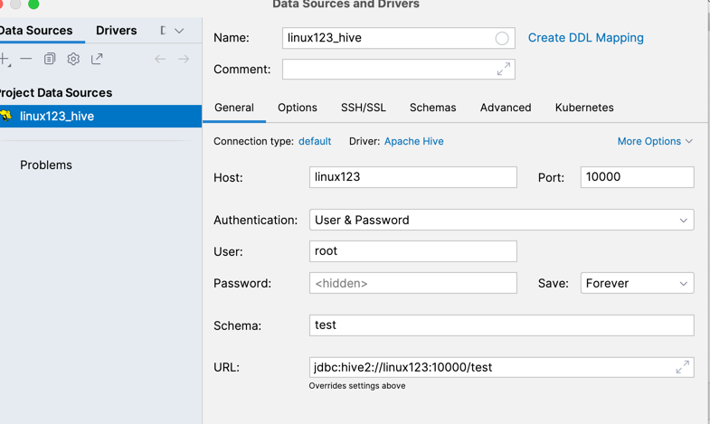

# Hive + Mysql安装
## Mysql 
版本：5.7.26
安装机器： linux123 hadoop 机器： linux121, linux122, linux123
### 1、环境准备(删除有冲突的依赖包、安装必须的依赖包) 
1) 删除MariaDB
```shell
# 查询是否安装了 mariadb
rpm -aq | grep mariadb
# 删除mariadb。-e 删除指定的套件;--nodeps 不验证套件的相互关联性 
rpm -e --nodeps mariadb-libs
```

2) 安装依赖
```shell
yum install perl -y
yum install net-tools -y
```

### 2、安装MySQL 
```shell
# 接压缩
tar xvf mysql-5.7.26-1.el7.x86_64.rpm-bundle.tar
# 依次运行以下命令
rpm -ivh mysql-community-common-5.7.26-1.el7.x86_64.rpm
rpm -ivh mysql-community-libs-5.7.26-1.el7.x86_64.rpm
rpm -ivh mysql-community-client-5.7.26-1.el7.x86_64.rpm 
rpm -ivh mysql-community-server-5.7.26-1.el7.x86_64.rpm
```

安装sql遇到问题即解决办法
1）执行命令
```shell
rpm -ivh mysql-community-client-5.7.26-1.el7.x86_64.rpm 
报错
error: Failed dependencies:
        libncurses.so.5()(64bit) is needed by mysql-community-client-5.7.26-1.el7.x86_64
        libtinfo.so.5()(64bit) is needed by mysql-community-client-5.7.26-1.el7.x86_64
```
原因： 安装的是mysql5.7， CentOS 9 默认不再提供这些旧版库
解决： 
```shell
sudo dnf install -y ncurses-compat-libs
```
但是安装 sudo dnf install -y ncurses-compat-libs 也报错 No match for argument: ncurses-compat-libs
Error: Unable to find a match: ncurses-compat-libs
解决：
```shell
sudo dnf install epel-release
```

2）执行命令rpm -ivh mysql-community-server-5.7.26-1.el7.x86_64.rpm 报错
```shell
error: Failed dependencies:
        libaio.so.1()(64bit) is needed by mysql-community-server-5.7.26-1.el7.x86_64
        libaio.so.1(LIBAIO_0.1)(64bit) is needed by mysql-community-server-5.7.26-1.el7.x86_64
        libaio.so.1(LIBAIO_0.4)(64bit) is needed by mysql-community-server-5.7.26-1.el7.x86_64
```
解决：
```shell
sudo dnf install libaio
```

#### 启动mysql
```shell
systemctl start mysqld
```

### 3、修改root口令(找到系统给定的随机口令、修改口令) 
```shell
grep password /var/log/mysqld.log   
输出： A temporary password is generated for root@localhost: yGP>h4cwXf<m
```

```shell
# 进入MySQL，使用前面查询到的口令 
mysql -u root -p
# 设置口令强度;将root口令设置为12345678;刷新
set global validate_password_policy=0;
set password for 'root'@'localhost' =password('12345678'); flush privileges;
```

### 4、在数据库中创建hive用户
```shell
-- 创建用户设置口令、授权、刷新
CREATE USER 'hive'@'%' IDENTIFIED BY '12345678'; 
GRANT ALL ON *.* TO 'hive'@'%';
FLUSH PRIVILEGES;
```


## Hive 安装
版本：2.3.7
安装机器： linux123
安装步骤: 
1、下载、上传、解压缩
2、修改环境变量
3、修改hive配置 
4、拷贝JDBC的驱动程序
5、初始化元数据库


### 下载、上传、解压缩  
```shell
scp ./apache-hive-2.3.7-bin.tar.gz root@192.168.33.13:/opt/lagou/software/
重命名文件夹
mv apache-hive-2.3.7-bin/ hive-2.3.7
```
### 修改环境变量
```shell
# 在 /etc/profile 文件中增加环境变量
export HIVE_HOME=/opt/lagou/servers/hive-2.3.7 
export PATH=$PATH:$HIVE_HOME/bin
# 执行并生效
source /etc/profile
```
### 修改hive配置
```shell
cd $HIVE_HOME/conf 
vi hive-site.xml
```

```xml
<?xml version="1.0" encoding="UTF-8" standalone="no"?>
<?xml-stylesheet type="text/xsl" href="configuration.xsl"?>
<configuration>
    <!-- hive元数据的存储位置 -->
    <property>
        <name>javax.jdo.option.ConnectionURL</name>
        <value>jdbc:mysql://linux123:3306/hivemetadata?createDatabaseIfNotExist=true&amp;useSSL=false</value>
        <description>JDBC connect string for a JDBC metastore</description>
    </property>
    <!-- 指定驱动程序 -->
    <property>
        <name>javax.jdo.option.ConnectionDriverName</name>
        <value>com.mysql.jdbc.Driver</value>
        <description>Driver class name for a JDBC
            metastore
        </description>
    </property>
    <!-- 连接数据库的用户名 -->
    <property>
        <name>javax.jdo.option.ConnectionUserName</name>
        <value>hive</value>
        <description>username to use against metastore
            database
        </description>
    </property>
    <!-- 连接数据库的口令 -->
    <property>
        <name>javax.jdo.option.ConnectionPassword</name>
        <value>12345678</value>
        <description>password to use against metastore
            database
        </description>
    </property>
</configuration>
```
### 拷贝JDBC的驱动程序
将 mysql-connector-java-5.1.46.jar 拷贝到 $HIVE_HOME/lib
```shell
cp /opt/lagou/software/mysql-connector-java-5.1.46.jar /opt/lagou/servers/hive-2.3.7/lib/
```
### 初始化元数据库
```shell
schematool -dbType mysql -initSchema
```

### 启动Hive，执行命令
```shell
# 启动hive服务之前，请先启动hdfs、yarn的服务 
start-dfs.sh
start-yarn.sh
hive
hive> show functions;
```

## Hive 属性配置
可在 hive-site.xml 中增加以下常用配置，方便使用。
### 数据存储位置
```xml

<property>
    <!-- 数据默认的存储位置(HDFS) -->
    <name>hive.metastore.warehouse.dir</name>
    <value>/user/hive/warehouse</value>
    <description>location of default database for the warehouse
    </description>
</property>
```

### 显示当前库
```xml

<property>
    <!-- 在命令行中，显示当前操作的数据库 -->
    <name>hive.cli.print.current.db</name>
    <value>true</value>
    <description>Whether to include the current database in the Hive prompt.
    </description>
</property>
```
### 显示表头属性
```xml

<property>
    <!-- 在命令行中，显示数据的表头 -->
    <name>hive.cli.print.header</name>
    <value>true</value>
</property>
```

### 本地模式
```xml

<property>
    <!-- 操作小规模数据时，使用本地模式，提高效率 -->
    <name>hive.exec.mode.local.auto</name>
    <value>true</value>
    <description>Let Hive determine whether to run in local mode automatically
    </description>
</property>
```

## 参数配置方式
```shell
-- 查看全部参数
 hive> set;
-- 查看某个参数
hive> set hive.exec.mode.local.auto; hive.exec.mode.local.auto=false
```

参数配置的三种方式:
```shell
1、用户自定义配置文件(hive-site.xml) 
2、启动hive时指定参数(-hiveconf) 
3、hive命令行指定参数(set)
配置信息的优先级:
set > -hiveconf > hive-site.xml > hive-default.xml
```
1、配置文件方式
默认配置文件:hive-default.xml 
用户自定义配置文件:hive-site.xml 
配置优先级:hive-site.xml > hive-default.xml 
配置文件的设定对本机启动的所有Hive进程有效;
配置文件的设定对本机所有启动的Hive进程有效;

2、启动时指定参数值
启动Hive时，可以在命令行添加 -hiveconf param=value 来设定参数，这些设定仅
对本次启动有效。
```shell
# 启动时指定参数
hive -hiveconf hive.exec.mode.local.auto=true
# 在命令行检查参数是否生效
hive> set hive.exec.mode.local.auto; hive.exec.mode.local.auto=true
```

3、命令行修改参数
可在 Hive 命令行中使用SET关键字设定参数，同样仅对本次启动有效
```shell
hive> set hive.exec.mode.local.auto=false;
hive> set hive.exec.mode.local.auto;
hive.exec.mode.local.auto=false
```

## hive 命令
-e:不进入hive交互窗口，执行sql语句
```shell
hive -e "select * from users"
```
-f:执行脚本中sql语句
```shell
# 创建文件hqlfile1.sql，内容:
select * from users # 执行文件中的SQL语句
hive -f hqlfile1.sql
# 执行文件中的SQL语句，将结果写入文件 
hive -f hqlfile1.sql >> result1.log
```
在命令行执行 shell 命令 / dfs 命令
```shell
hive> ! ls;
hive> ! clear;
hive> dfs -ls / ;
```

### 后台启动hive
```shell
hive --service hiveserver2 &
```

## idea 连接hive


遇到问题
1) 
问题：Could not open client transport with JDBC Uri: jdbc:hive2://linux123:10000/test: java.net.ConnectException: Connection refused
解决：hive --service hiveserver2 &

```shell
Could not open client transport with JDBC Uri: jdbc:hive2://linux123:10000/test: Failed to open new session: java.lang.RuntimeException: org.apache.hadoop.ipc.RemoteException(org.apache.hadoop.security.authorize.AuthorizationException): User: root is not allowed to impersonate hadoop org.apache.hadoop.ipc.RemoteException:User: root is not allowed to impersonate hadoo
```
原因
```shell
Hadoop 默认禁止用户代理（user impersonation），需要手动配置允许特定用户（如 root）模拟其他用户。
```
解决：
修改 Hadoop 核心配置，在 core-site.xml 中添加以下配置
```xml
<property>
    <name>hadoop.proxyuser.root.hosts</name>
    <value>*</value>  <!-- 允许来自任何主机的root用户 -->
</property>
<property>
<name>hadoop.proxyuser.root.groups</name>
<value>*</value>  <!-- 允许模拟任何用户组 -->
</property>
<property>
<name>hadoop.proxyuser.root.users</name>
<value>*</value>  <!-- 允许模拟任何用户 -->
</property>
```

## Hive metastore 远程模式
规划：
metastore： linux121，linux123
client: linux122

配置步骤:**
1、将 linux123 的 hive 安装文件拷贝到 linux121、linux122 
2、在linux121、linux123上分别启动 metastore 服务
```shell
# 启动 metastore 服务
nohup hive --service metastore &
# 查询9083端口(metastore服务占用的端口) 
lsof -i:9083
# 安装lsof
yum install lsof
```
3、修改 linux122 上hive-site.xml。删除配置文件中:MySQL的配置、连接数据库 的用户名、口令等信息;增加连接metastore的配置:
```xml
<!-- hive metastore 服务地址 -->
<property>
    <name>hive.metastore.uris</name>
    <value>thrift://linux121:9083,thrift://linux123:9083</value>
</property>
```

4、启动hive。此时client端无需实例化hive的metastore，启动速度会加快。
5、高可用测试。关闭已连接的metastore服务，发现hive连到另一个节点的服务 上，仍然能够正常使用。


# hive 调优案例

## 数据准备
```sql
-- 创建数据库
create database tuning;

-- 创建表
create table if not exists student_txt(
    s_no string comment '学号',
    s_name string comment '姓名',
    s_birth string comment '出生日期',
    s_age int comment '年龄',
    s_sex string comment '性别',
    s_score int comment '综合得分',
    s_desc string comment '自我介绍'
)
row format delimited
fields terminated by '/t';

-- 数据加载, 数据太多，本地测试设置Hadoop的dfs.replica为1
load data local inpath '/home/hive/student/*.txt' into table student_txt;
```
数据文件位置:/root/hive/student，50个文件，每个文件平均大小 40M 左右，包 含4W条左右的信息;

遇到问题： 文件load量大，磁盘空间不足： df -h查看磁盘空间不足
解决：删除不必要文件，释放虚拟机空间

## SQL案例
查询 student_txt 表，每个年龄最晚出生和最早出生的人的出生日期，并将其存入表
student_stat 中。 student_stat 表结构如下
```sql
create table student_stat(
    age int,
    brith string)
partitioned by (tp string);
```


yum install ant asciidoc cyrus-sasl-devel cyrus-sasl-gssapi cyrus-sasl-plain gcc gcc-c++ krb5-devel libffi-devel libxml2-devel libxslt-devel make mysql mysql-devel openldap-devel python-devel sqlite-devel gmp-devel