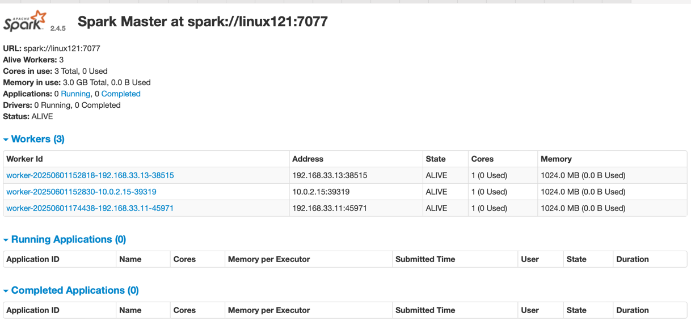

# Spark 安装
1、下载软件解压缩，移动到指定位置
```shell
cd /opt/lagou/software/
tar zxvf spark-2.4.5-bin-without-hadoop-scala-2.12.tgz
mv spark-2.4.5-bin-without-hadoop-scala-2.12/ ../servers/spark-2.4.5/
```

2、设置环境变量，并使之生效
```shell
vi /etc/profile
export SPARK_HOME=/opt/lagou/servers/spark-2.4.5
export PATH=$PATH:$SPARK_HOME/bin:$SPARK_HOME/sbin
source /etc/profile
```

3、修改配置
文件位置:$SPARK_HOME/conf 
修改文件:slaves、spark-defaults.conf、spark-env.sh、log4j.properties
slaves
```shell
cp slaves.template slaves
vi slaves

# 配置节点信息
linux121
linux122
linux123
```

spark-defaults.conf
```shell
cp spark-defaults.conf.template spark-defaults.conf
vi spark-defaults.conf

spark.master                     spark://linux121:7077
spark.eventLog.enabled           true
spark.eventLog.dir               hdfs://linux121:9000/spark-eventlog
spark.serializer                 org.apache.spark.serializer.KryoSerializer
spark.driver.memory              512M
```
创建 HDFS 目录:hdfs dfs -mkdir /spark-eventlog
备注:
spark.master。定义master节点，缺省端口号 7077 
spark.eventLog.enabled。开启eventLog 
spark.eventLog.dir。eventLog的存放位置 
spark.serializer。一个高效的序列化器 
spark.driver.memory。定义driver内存的大小(缺省1G)

spark-env.sh
```shell
cp spark-env.sh.template spark-env.sh
vi spark-env.sh

export JAVA_HOME=/opt/lagou/servers/jdk1.8.0_231
export HADOOP_HOME=/opt/lagou/servers/hadoop-2.9.2
export HADOOP_CONF_DIR=/opt/lagou/servers/hadoop-2.9.2/etc/hadoop
export SPARK_DIST_CLASSPATH=$(/opt/lagou/servers/hadoop-2.9.2/bin/hadoop classpath)
export SPARK_MASTER_HOST=linux121
export SPARK_MASTER_PORT=7077
```

4、将Spark软件分发到集群;修改其他节点上的环境变量
```shell
cd /opt/lagou/software/
scp -r spark-2.4.5/ linux122:$PWD
scp -r spark-2.4.5/ linux123:$PWD
```

5、启动集群
```shell
cd $SPARK_HOME/sbin
./start-all.sh
```

分别在linux121、linux122、linux123上执行 jps，可以发现: 
linux121:Master、Worker
linux122:Worker
linux123:Worker
此时 Spark 运行在 Standalone 模式下。 在浏览器中输入:http://linux121:8080/
可以看见如下 Spark 的 Web 界面:
